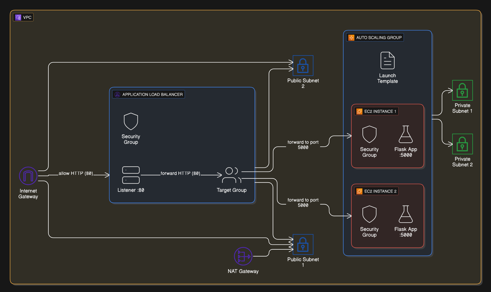

## Overview

This project builds on Project 2, where you deployed a Flask app in a custom VPC with ALB and Auto Scaling using the AWS CLI. In this version, you will automate the deployment of the same Flask application using **Terraform**, taking advantage of Infrastructure as Code for improved readability, version control, and easier management compared to manual CLI steps. In addition to the core infrastructure, you will add Elastic Block Storage (EBS) to each EC2 instance for persistent data storage, and configure custom SSL certificates to securely handle HTTPS (port 443) requests.

The architecture includes a **Launch Template**, **Application Load Balancer (ALB)**, **Auto Scaling Group (ASG)**, a **custom VPC**, and **EBS storage** attached to each EC2 instance. You will also store and retrieve trivial data on the EBS volume to demonstrate persistent storage. This project enables SSL/TLS termination at the ALB using AWS Certificate Manager (ACM) and Terraform to provide secure HTTPS access to your application.

At completion, you'll have:
- A Flask web app running on EC2 instances
- Auto Scaling and health check recovery
- A public ALB managing HTTP traffic
- Infrastructure created entirely via Terraform
- EBS storage attached to each instance, with data written to it

---
## Prerequisites

- Terraform installed and configured
- AWS CLI installed (for verification and manual checks)
- EC2 Key Pair created (e.g., `MyEC2KeyPair`)
    See Appendix for instructions if you need to create
- IAM Role for EC2 with SSM permissions (e.g., `EC2SSMRole`)
    See Appendix for instructions if you need to create
- Basic familiarity with EC2, VPCs, and Terraform
- A domain you control in Route 53 (e.g., `clearedforcloud.com`) for creating `ec2.clearedforcloud.com` — Terraform will request/validate the ACM cert automatically

---


---
## Project Workflow

1.   [Create the Flask App Bootstrap Script](#create-the-flask-app-bootstrap-script)
2.   [Write the Terraform Configuration](#2-write-the-terraform-configuration)
3.   [Initialize and Apply Terraform](#3-initialize-and-apply-terraform)
4.   [Test ALB & ASG Behavior](#4-test-alb-and-asg-behavior)
5.   [Simulate Failure & Observe Auto Healing](#5-simulate-failure-and-observe-auto-healing)
6.   [Clean Up Resources](#6-clean-up-resources)
7.   [Troubleshooting & Lessons Learned](#7-troubleshooting-and-lessons-learned)
8.   [Final Thoughts](#final-thoughts)

---



---
<a name="create-the-flask-app-bootstrap-script"></a>
### 1. Create the Flask App Bootstrap Script

Create a shell script to install dependencies, create the app.py, and persistently mount the EBS volume. This version is idempotent and runs Flask as a systemd service, so restarts are handled cleanly. Save this as `user-data.sh`:

```bash
#!/bin/bash

# Send everything this script prints (stdout and stderr) to a log file on the instance.
# You can download or view /var/log/user-data.log later via SSM to troubleshoot boot issues.
exec > /var/log/user-data.log 2>&1

# Safer shell options:
# -e  = exit immediately if any command fails
# -u  = treat unset variables as an error
# -x  = print each command before running it (helps with debugging)
# -o pipefail = if any command in a pipeline fails, the whole pipeline fails
set -euxo pipefail

# Keep the OS packages up to date and install Python 3 + pip (Amazon Linux 2023 uses dnf).
# We install Flask globally for simplicity in this demo. In production, consider using a virtualenv.
dnf update -y
dnf install -y python3 python3-pip
python3 -m pip install --upgrade pip
python3 -m pip install flask

# Variables for the extra EBS volume and where to mount it.
# Terraform attaches a secondary gp3 volume to each instance at /dev/xvdb.
# We'll mount it at /mnt/ebs and store simple data there to prove persistence.
DEVICE="/dev/xvdb"
MOUNT_POINT="/mnt/ebs"

# Wait for the EBS device to show up in the OS. On fast boots, udev may need a few seconds
# to create the block device. We check up to ~60s (20 tries x 3s) before giving up.
for i in {1..20}; do
  if [ -b "$DEVICE" ]; then
    break
  fi
  sleep 3
done

# Format the disk if it's brand new. The `file -s` command prints "data" for an unformatted block
# device. We only run mkfs once; on subsequent boots the device will already have a filesystem.
if file -s "$DEVICE" | grep -q "data$"; then
  mkfs -t ext4 "$DEVICE"
fi

# Create a mount point and ensure the disk mounts automatically on every boot using /etc/fstab.
# We reference the disk by UUID (not device name) so the mount remains stable if the name changes.
mkdir -p "$MOUNT_POINT"
UUID=$(blkid -s UUID -o value "$DEVICE")
if ! grep -q "$UUID" /etc/fstab; then
  echo "UUID=$UUID $MOUNT_POINT ext4 defaults,nofail 0 2" >> /etc/fstab
fi

# Mount all filesystems declared in fstab. If for some reason that fails, try a direct mount once.
mount -a || mount "$DEVICE" "$MOUNT_POINT"

# Let the default ec2-user read/write the mount so our sample app can create files there.
chown ec2-user:ec2-user "$MOUNT_POINT"

# Put a small file on the EBS volume the first time. This helps prove persistence across reboots
# and instance replacements (when the ASG reattaches a new volume to a new instance).
if [ ! -f "$MOUNT_POINT/test.txt" ]; then
  echo "EBS volume mounted!" > "$MOUNT_POINT/test.txt"
fi

# Create a tiny Flask app that reads the text we wrote to the EBS volume and returns it in HTTP.
# This is a minimal example to verify networking and storage are working end-to-end.
install -d -o ec2-user -g ec2-user /home/ec2-user/myapp
cat > /home/ec2-user/myapp/app.py << 'EOF'
from flask import Flask
app = Flask(__name__)

@app.route('/')
def home():
    with open('/mnt/ebs/test.txt', 'r') as f:
        data = f.read()
    return f'Hello from Flask on EC2 with ALB, ASG, and EBS! Data: {data}'

if __name__ == '__main__':
    app.run(host='0.0.0.0', port=5000)
EOF
chown -R ec2-user:ec2-user /home/ec2-user/myapp

# Create a systemd service so the app runs in the background, restarts on failure,
# and starts automatically on boot.
cat > /etc/systemd/system/flask.service << 'EOF'
[Unit]
Description=Flask App
# Start the service after basic networking is up
After=network.target

[Service]
User=ec2-user                      # run as the regular ec2-user
Group=ec2-user                     # group ownership for created files
WorkingDirectory=/home/ec2-user/myapp
ExecStart=/usr/bin/python3 /home/ec2-user/myapp/app.py  # start the Flask app
Restart=always                     # automatically restart if the app exits/crashes
RestartSec=3                       # wait 3 seconds before restarting

[Install]
WantedBy=multi-user.target         # start when the system reaches multi-user mode
EOF

# Tell systemd to pick up the new unit file and then enable + start the service now.
systemctl daemon-reload
systemctl enable --now flask
```

---
<a name="2-write-the-terraform-configuration"></a>
### 2. Write the Terraform Configuration

Below is a production-ready `main.tf` that implements the VPC, subnets, routing, security groups, ALB with HTTPS and HTTP→HTTPS redirect, target group, launch template with a gp3 EBS volume, and an Auto Scaling Group using ELB health checks. It also includes variables and outputs so you can tune and discover values without shell parsing. Terraform also automates the ACM certificate request/validation and the Route 53 A-alias record for your subdomain, so you don’t need any manual console steps.

```hcl
${
  // We keep the rendered file in /home/mudge/apps/ec2/project3/main.tf
  // See that file for the full content. The key highlights:
  // - Variables for region, CIDRs, instance_type, key_name, tags
  // - Dynamic AL2023 AMI via SSM
  // - gp3 EBS, persistent mount via user-data
  // - HTTPS listener + HTTP redirect
  // - Outputs: alb_dns_name, alb_zone_id, asg_name
  "See main.tf in this repo for the complete configuration."
}
```

---
<a name="3-initialize-and-apply-terraform"></a>
### 3. Initialize and Apply Terraform

Run the following commands in your project directory:

```bash
terraform init -upgrade
terraform plan \
  -var "domain_zone_name=clearedforcloud.com" \
  -var "subdomain=ec2" \
  -out tfplan
terraform apply "tfplan"
```

Terraform will provision all resources, request/validate the ACM certificate via DNS, create the ALB HTTPS listener, and publish the Route 53 alias.

---
<a name="4-test-alb-and-asg-behavior"></a>
### 4. Test ALB and ASG Behavior

After deployment, retrieve the DNS name of your ALB using outputs:

```bash
terraform output alb_dns_name
```

Visit the DNS in a browser. You should see:

```
Hello from Flask on EC2 with ALB, ASG, and EBS! Data: EBS volume mounted!
```

---
<a name="5-simulate-failure-and-observe-auto-healing"></a>
### 5. Simulate Failure and Observe Auto Healing

Terminate an instance from the AWS Console or CLI. The ASG will automatically replace it. You can monitor the ASG in the AWS Console or with:

```bash
aws autoscaling describe-auto-scaling-groups --auto-scaling-group-names $(terraform output -raw asg_name)
```

To document the auto-healing end-to-end (recommended commands):

Option A — Kill one instance and watch the replacement

```bash
# From the project folder
ASG_NAME=$(terraform output -raw asg_name)
REGION=us-east-1

# 1) List current instances in the ASG
aws autoscaling describe-auto-scaling-groups \
  --auto-scaling-group-names "$ASG_NAME" \
  --region $REGION \
  --query "AutoScalingGroups[0].Instances[].{Id:InstanceId,LC:LifecycleState,AZ:AvailabilityZone}" \
  --output table

# 2) Pick one InService instance ID automatically
IID=$(aws autoscaling describe-auto-scaling-groups \
  --auto-scaling-group-names "$ASG_NAME" \
  --region $REGION \
  --query "AutoScalingGroups[0].Instances[?LifecycleState=='InService']|[0].InstanceId" \
  --output text)
echo "Terminating $IID (ASG will replace it)"

# 3) Terminate it without decreasing desired capacity (triggers replacement)
aws autoscaling terminate-instance-in-auto-scaling-group \
  --instance-id "$IID" \
  --no-should-decrement-desired-capacity \
  --region $REGION

# 4) Get Target Group ARN (for health checks) and watch states
TG_ARN=$(aws elbv2 describe-target-groups \
  --names ec2-tg \
  --region $REGION \
  --query 'TargetGroups[0].TargetGroupArn' \
  --output text)

# 5) Poll ASG membership, target health, and app response (takes a few minutes)
for i in {1..10}; do
  echo "--- Poll $i ---"
  aws autoscaling describe-auto-scaling-groups \
    --auto-scaling-group-names "$ASG_NAME" \
    --region $REGION \
    --query "AutoScalingGroups[0].Instances[].{Id:InstanceId,LC:LifecycleState,AZ:AvailabilityZone}" \
    --output table | sed -n '1,20p'
  aws elbv2 describe-target-health \
    --target-group-arn "$TG_ARN" \
    --region $REGION \
    --query 'TargetHealthDescriptions[].TargetHealth.State' \
    --output text || true
  # App should remain available (some targets may be draining/unhealthy briefly)
  curl -s -o /dev/null -w "%{http_code}\n" https://ec2.clearedforcloud.com/
  sleep 15
done
```

Option B — Roll instances using an Instance Refresh (safer for larger fleets)

```bash
ASG_NAME=$(terraform output -raw asg_name)
REGION=us-east-1

# Start a refresh (keeps at least 50% healthy during rotation)
aws autoscaling start-instance-refresh \
  --auto-scaling-group-name "$ASG_NAME" \
  --preferences MinHealthyPercentage=50,InstanceWarmup=120 \
  --region $REGION

# Watch status
aws autoscaling describe-instance-refreshes \
  --auto-scaling-group-name "$ASG_NAME" \
  --max-records 1 \
  --region $REGION \
  --query 'InstanceRefreshes[0].Status'
```

What to capture for your notes/screenshots:
- The terminated instance moving through Terminating/Terminated and a new instance appearing as Pending/InService.
- Target Group health states changing (e.g., draining → healthy) during replacement.
- HTTP 301 redirect to HTTPS and HTTPS 200 from https://ec2.clearedforcloud.com/ throughout the event.

---
<a name="6-clean-up-resources"></a>
### 6. Clean Up Resources

To avoid unexpected charges, destroy all provisioned infrastructure:

```bash
terraform destroy
```

---
<a name="7-troubleshooting-and-lessons-learned"></a>
### 7. Troubleshooting & Lessons Learned

- Ensure your AMI supports the `dnf` package manager and Python 3.
- EBS device name may differ by instance type/AMI; adjust `/dev/xvdb` if needed.
- Security groups must allow ALB-to-EC2 traffic on port 5000.
- Use SSM for troubleshooting private EC2 instances.
- NAT Gateway incurs hourly charges; destroy when done.


---

<a name="dns-and-acm"></a>
### Appendix: DNS and ACM validation (required for HTTPS)

Terraform now handles ACM + DNS end-to-end:

1) Provide your hosted zone and subdomain as variables (e.g., domain_zone_name=clearedforcloud.com, subdomain=ec2).
2) Terraform requests a public ACM certificate for your FQDN (ec2.clearedforcloud.com), creates the DNS validation records in Route 53, waits for the certificate to be issued, and then creates the HTTPS listener using that cert.
3) Terraform also creates an A (Alias) record pointing your subdomain to the ALB after the ALB is provisioned.

Notes:
- Subdomains are free; you pay for the base domain and standard Route 53 hosted zone fees.
- Avoid DNS conflicts with Amplify—use a unique subdomain name (e.g., `ec2.clearedforcloud.com`).
- First-time ACM issuance can take a few minutes after DNS records are created. Terraform will wait on validation before creating the HTTPS listener.

---

<a name="final-thoughts"></a>
### 8. Final Thoughts

Using Terraform for this project provides repeatability, version control, and easier management. From here you can add RDS, S3, or ECS. Consider adding WAF on the ALB and using Parameter Store/Secrets Manager for app config.

---

<a name="appendix"></a>
### 9. Appendix

Verify or create the EC2SSMRole instance profile (required for SSM access)

Verify the IAM instance profile exists (used by EC2 for SSM Session Manager):

```bash
aws iam get-instance-profile --instance-profile-name EC2SSMRole --query "InstanceProfile.Arn" --output text
```

If it doesn’t exist, create it:

```bash
# 1) Create the role with an EC2 trust policy
cat > /tmp/ec2-trust-policy.json << 'EOF'
{
  "Version": "2012-10-17",
  "Statement": [
    {
      "Effect": "Allow",
      "Principal": { "Service": "ec2.amazonaws.com" },
      "Action": "sts:AssumeRole"
    }
  ]
}
EOF
aws iam create-role \
  --role-name EC2SSMRole \
  --assume-role-policy-document file:///tmp/ec2-trust-policy.json

# 2) Attach the SSM core managed policy
aws iam attach-role-policy \
  --role-name EC2SSMRole \
  --policy-arn arn:aws:iam::aws:policy/AmazonSSMManagedInstanceCore

# 3) Create a matching instance profile and add the role to it
aws iam create-instance-profile --instance-profile-name EC2SSMRole
aws iam add-role-to-instance-profile \
  --instance-profile-name EC2SSMRole \
  --role-name EC2SSMRole

# Note: it may take ~30–60s for the instance profile to propagate
```

Optional: verify your EC2 key pair exists (replace the name if you changed it in variables):

```bash
aws ec2 describe-key-pairs --key-names MyEC2KeyPair --query 'KeyPairs[0].KeyName' --output text
```